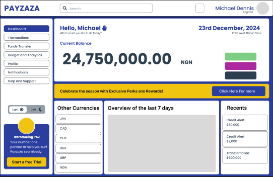

# This is the [Payzaza Payment System](https://qps.vercel.app/) project.



## Getting Started
First, install the packages & dependencies with 
```
yarn add(install)
# or
npm install
```
run the development server:

```bash
yarn dev
# or
npm run dev
```

Open [http://localhost:3000](http://localhost:3000) with your browser to see the result.

## Active Pages [For Demo]
- Login/Register (uses localStorage for now)
- Landing Page (redesign soon*)
- Dashboard ``` COMPLETED ```
- Loans Page ``` MODALS PENDING ```
- Contacts & Social Banking Page ``` COMPLETED ```
- Transactions History???

Recorder now encodes the recorded audio data


## Learn More About Next.js

To learn more about Next.js, take a look at the following resources:

- [Next.js Documentation](https://nextjs.org/docs) - learn about Next.js features and API.
- [Learn Next.js](https://nextjs.org/learn) - an interactive Next.js tutorial.

You can check out [the Next.js GitHub repository](https://github.com/vercel/next.js/) - your feedback and contributions are welcome!

## Deploy on Vercel

The easiest way to deploy your Next.js app is to use the [Vercel Platform](https://vercel.com/new?utm_medium=default-template&filter=next.js&utm_source=create-next-app&utm_campaign=create-next-app-readme) from the creators of Next.js.

Check out our [Next.js deployment documentation](https://nextjs.org/docs/deployment) for more details.
